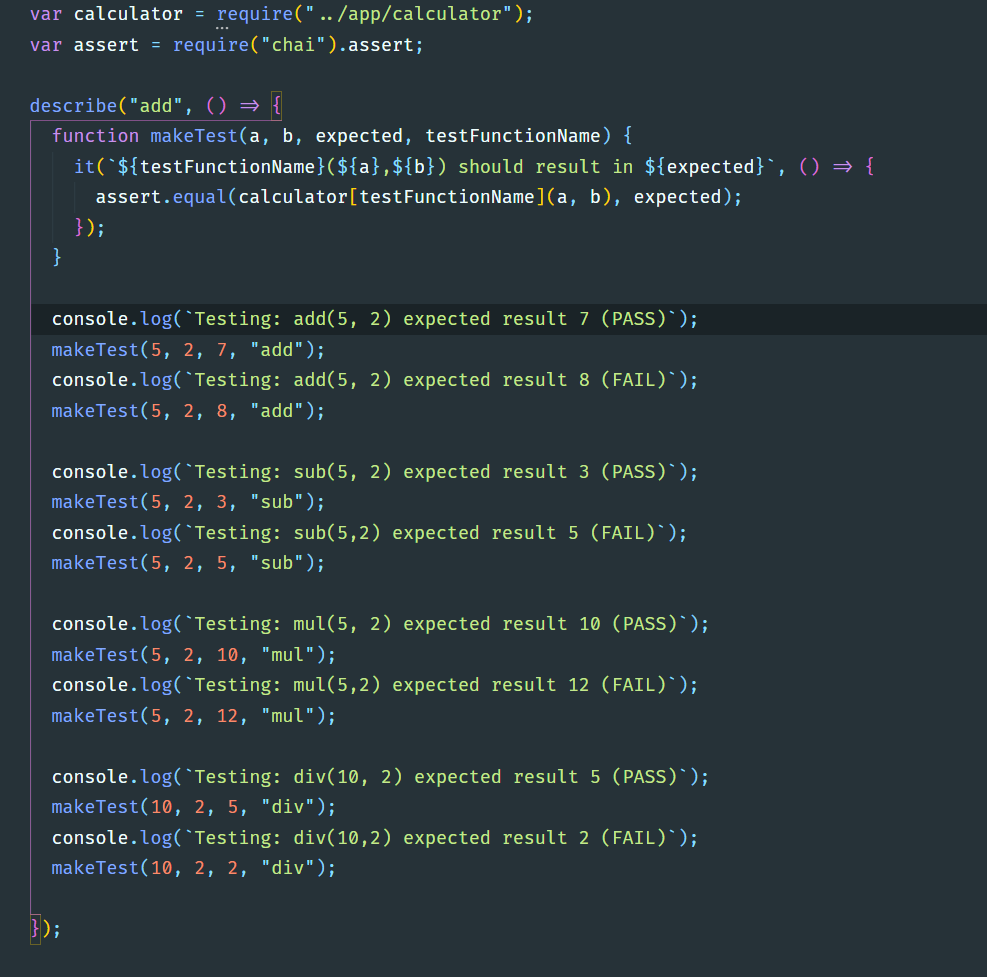
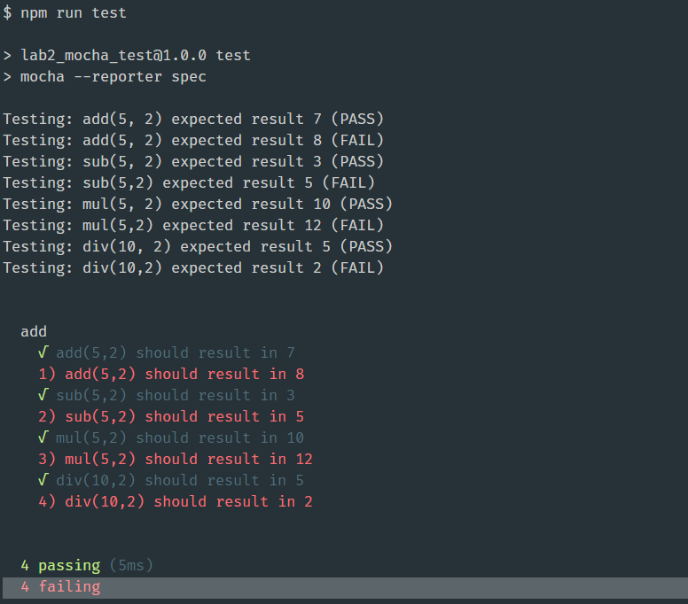

# COMP 3133 - Lab02: Testing NodeJS app using mocha

Note: Create GitHub repository and commit all your code to GitHub

1) Download given node project name lab2_mocha_test ZIP file
2) Add package.json file to the project
    - Change directory to lab2_mocha_test
      `npm init -y`

3) Setup project to working with mocha
    -	Install mocha module
      `npm install --save mocha chai`

4)	Write test cases to perform calculator test 
    -	Create test/calculator.js file to write all your test cases
    -	Write one success and one fail test of add, sub, div and mul for calculator.js
    -	Sample Test cases
      `add(5, 2) expected result 7 PASS`
      `add(5,2) expected result 8 FAIL`
      `sub(5, 2) expected result 3 PASS`
      `sub(5,2) expected result 5 FAIL`
      `mul(5, 2) expected result 10 PASS`
      `mul(5,2) expected result 12 FAIL`
      `div(10, 2) expected result 5 PASS`
      `div(10,2) expected result 2 FAIL`

5)	Display your choice pass/fail messages for each test

### Submission

Upload the ZIP file and screenshot showing your source code and output
Also Provide your GitHub link in the comment

### Reference
-	Lab work done during class
-	https://javascript.info/testing-mocha

## Result
Code:

Result:

